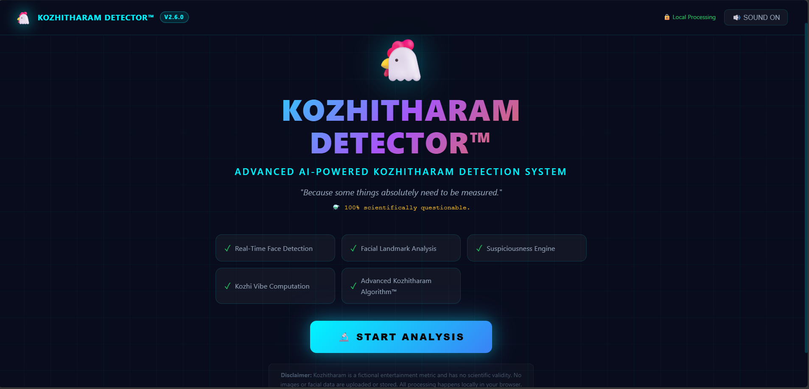
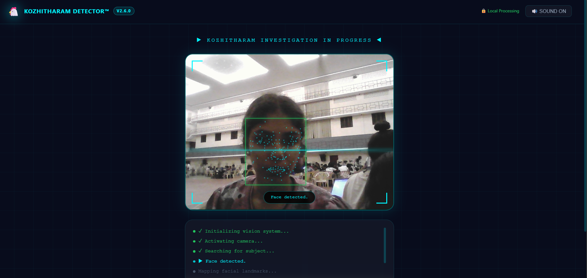
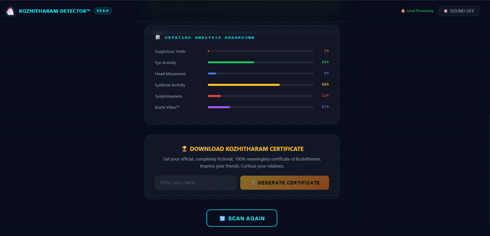
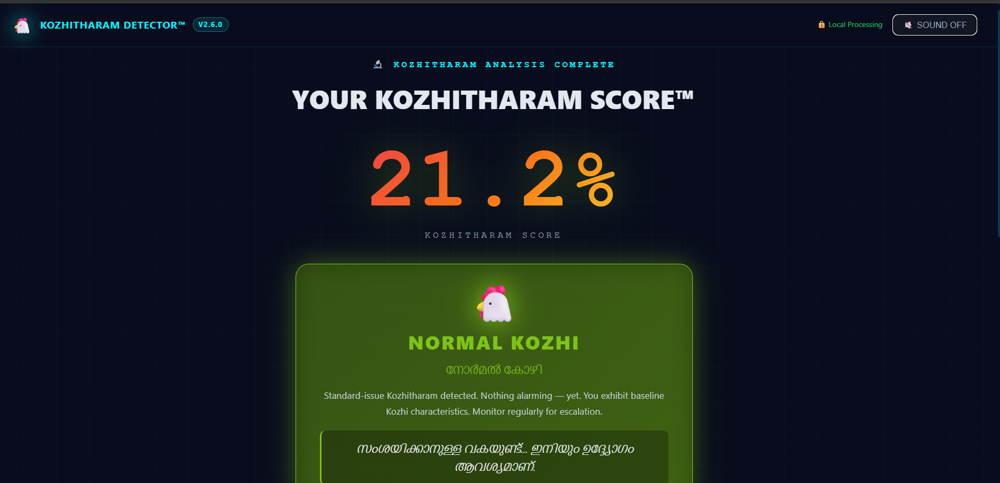
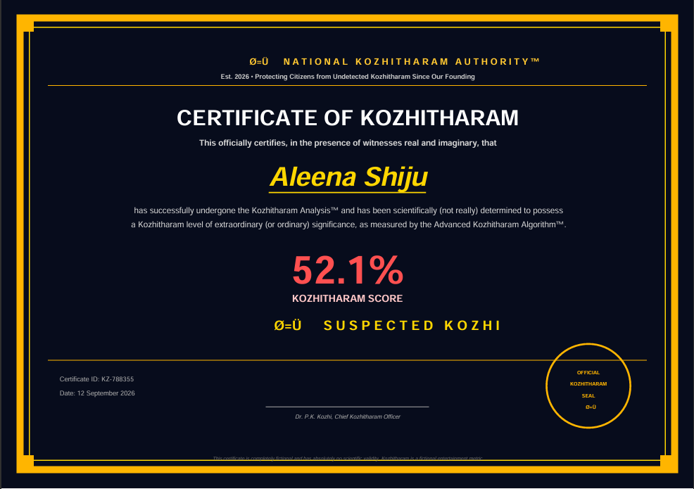

# 🐔 Kozhitharam Detector™

> *"Because some things absolutely need to be measured."*

## Basic Details

### Team Name: Kozhitharam Research Analytics

### Team Members
- Team Lead: Aleetta Viju — SAHRDAYA COLLEGE OF ENGINEERING AND TECHNOLOGY
- Member 2: Aleena Shiju — SAHRDAYA COLLEGE OF ENGINEERING AND TECHNOLOGY

### Project Description

An advanced AI-powered Kozhitharam Detection System that uses real-time computer vision (MediaPipe Face Landmarker) to analyze a person's face and compute their fictional **Kozhitharam Score™** — a completely made-up metric that serves no scientific purpose whatsoever.

### The Problem (that doesn't exist)

Society has long struggled with identifying Kozhitharam in everyday life. Traditional methods (asking, guessing, chicken-related intuition) have proven unreliable. Until now, there was no objective, algorithmic, computer-vision-based way to measure how much Kozhitharam a person possesses.

### The Solution (that nobody asked for)

We built a sophisticated-looking AI dashboard that uses real MediaPipe facial landmark detection to extract measurable quantities from your face (eye openness, mouth activity, eyebrow movement, head tilt), feeds them into the **Advanced Kozhitharam Algorithm™**, and produces an official score between 0% and 100%. The result is presented with full scientific gravitas, a dramatic Malayalam verdict, and a downloadable official certificate.

---

## Technical Details

### Technologies/Components Used

**For Software:**
- **Languages:** JavaScript (ES2022+), JSX, CSS3
- **Frameworks:** React 18, Vite 5
- **Libraries:**
  - `@mediapipe/tasks-vision` — real-time face landmarker (478 points)
  - `jsPDF` — client-side PDF certificate generation
- **Tools:** Node.js, npm, Git

### Implementation

#### Installation

```bash
npm install
```

#### Development

```bash
npm run dev
```

Open [http://localhost:5173](http://localhost:5173)

#### Production Build

```bash
npm run build
npm run preview
```

---

## Features

- ✅ Real-time webcam face detection using MediaPipe
- ✅ Facial landmark visualization (478 points)
- ✅ Fictional Kozhitharam scoring algorithm
- ✅ 6 progressive classification tiers (Kunjikkozhi → Kozhitharam Overload)
- ✅ Animated score reveal with breakdown bars
- ✅ Original Malayalam comedy verdicts
- ✅ Audio reaction system (sound-on/off toggle)
- ✅ Downloadable PDF Kozhitharam Certificate
- ✅ Fully browser-based — no server, no data upload
- ✅ Dark futuristic AI dashboard UI
- ✅ Responsive design

---

## Project Documentation

### Screenshots

*(Visual walkthrough of the app)*

<!-- 1. Landing Page -->

The landing page with the START ANALYSIS button and project intro.

<!-- 2. Face Scanning -->

Live camera feed with facial landmark overlay and scanning HUD.

<!-- 3. Analysis -->

Ongoing analysis view showing progress and metric extraction.

<!-- 4. Kozhitharam Result -->

Final score reveal with breakdown bars and Malayalam verdict.

<!-- 5. Generated Certificate -->

Preview of the downloadable Kozhitharam certificate PDF.

### Demo Video

Watch the demo video: [screenshots/demo/kozhi-demo.mp4](screenshots/demo/kozhi-demo.mp4)
Short walkthrough of the app and its features.

### User Flow

```
Landing Page → START ANALYSIS → Camera Permission → Face Scanner
→ Face Detected → Facial Landmark Analysis → Fake Scientific Analysis
→ Kozhitharam Score → Classification → Detailed Report
→ Malayalam Verdict → Download Certificate → Scan Again
```

---

## Privacy

> 🔒 Camera processing occurs **locally in your browser**. No face images or video are uploaded, stored, or transmitted. All computation happens on-device using MediaPipe's WASM runtime.

---

## Disclaimer

> The Kozhitharam Score™ is entirely fictional and is intended purely for entertainment at the TinkerHub Useless Projects event. It has no scientific validity. Do not make life decisions based on your Kozhitharam Score.

---

## Team Contributions

- Aleetta Viju: [Specific contributions]
- Aleena Shiju: [Specific contributions]

---

Made with ❤️ at TinkerHub Useless Projects


